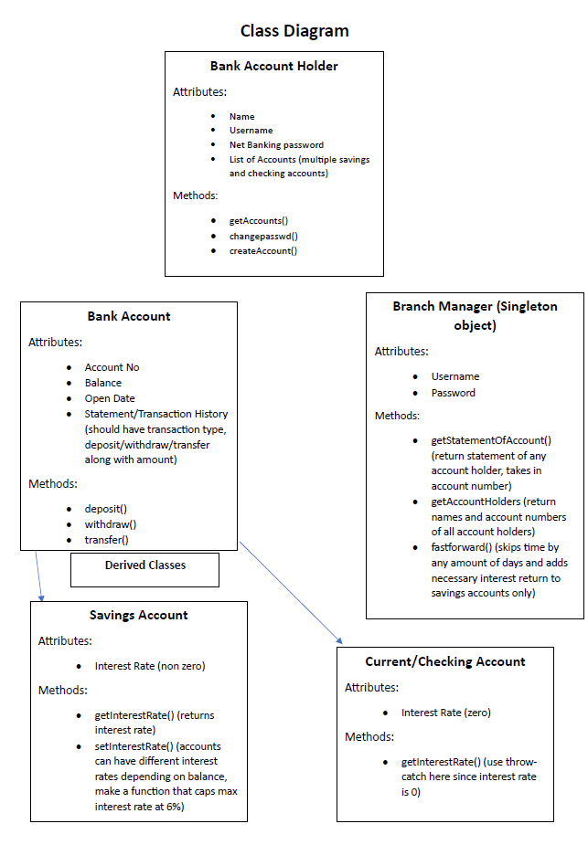

# Banking Client

You got your dream job in World Bank. To give other employees a run for their money, you have to come up with an OOPS based banking client.

---
## High Level Overview

### Login In and Account creation

1. The system should be accessed via a CLI (Command Line Interface)
2. It should have option from **Account Holder** Login/Sign-Up. Also have an option from **Branch Manager** Login
3. Username is chosen by account holder. Make system to ensure uniqueness of usernames.
4. Sign Up process is decoupled from account creation. Account creation option should be made visible after Login only.
5. Single Account holder can have multiple accounts (both of savings and checking type.)

### Accounts
1. Accounts should have statements linked with them.
2. Opening balance is required when opening an account
3. Generate a random 9 digit number for account number (or you can also serially assign account numbers from 1 onwards)
4. Savings accounts have an upper transaction limit while checking accounts don't, decide the limit yourself and keep it constant for all savings accounts
5. Have an option to view statements
6. Have an option to close an account
7. Maintain a **global date variable** and all transactions are to be signed with the global date in the statements.

### Branch Manager

1. Nothing special, class diagram is self explanatory.
2. **Fast Forward method** is an explicit method that can be called from the command line interface when the manager is logged in. It skips whatever amount of days input. Depending on opening date of accounts, savings account maybe deposited by interest return from bank. Beware that banks only deposit interests monthly or trimonthly (up to you).

---

## Low Level Overview

1. Choose appropriate access specifiers **(public, private and protected)** for the various attributes
2. Given below are the class diagrams for the classes that you have to implement
3. Do not restrict yourself to these, they are just to get you started and help you get an idea.

&nbsp;&nbsp;

---

## Submission

- Here is the Github <a href="https://github.com/AerialRobotics-IITK/Induction_Y23">link</a>
- Make a fork of this repo and create a branch in the fork with the following name: [firstname]_[lastname_initial] eg. atulya_s
- Then create a pull request by 23:59:59, 11th May 2024
- In case of any doubts, create an issue on the main repo
